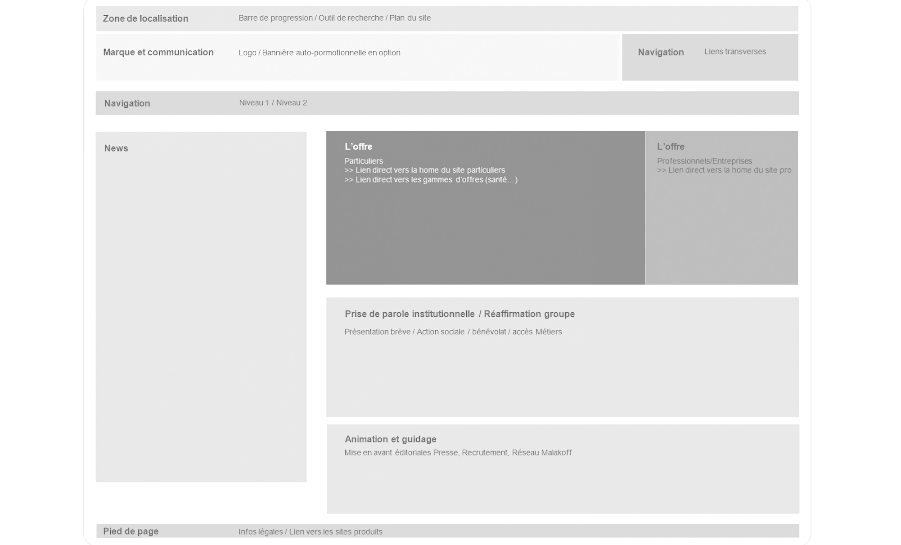
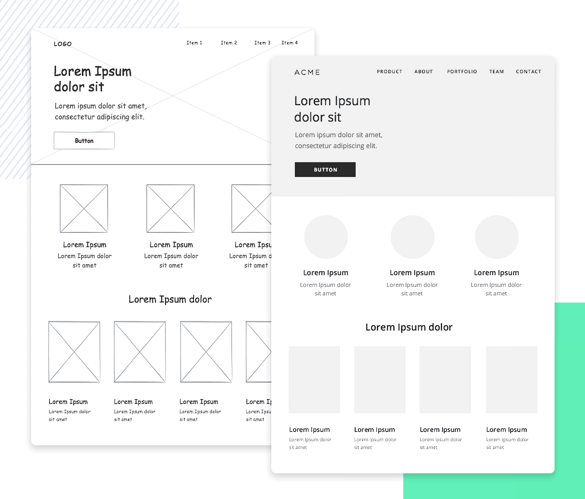
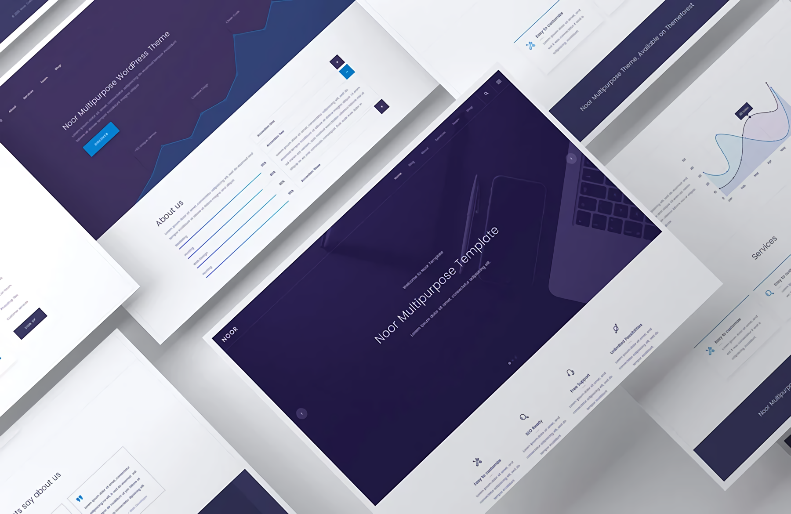
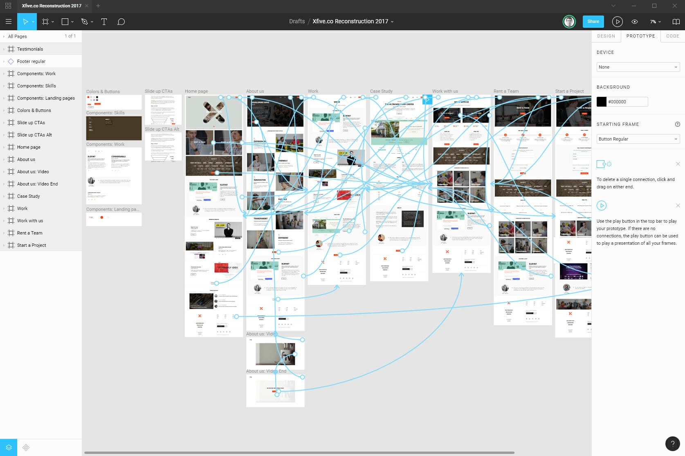

# LA DIFFÉRENCE ENTRE : ZONING, WIREFRAME, MOCKUP, ET PROTOTYPE

## Zoning
Le zoning est un plan grossièr d'une page web. Sous forme de schémas très simples, il indique l'emplacement des principaux éléments du gabarit tel que navbar, logo, sidebar, footeer, etc...
L'étape du zoning intervient après la définition de l'arborescence de la page et avant la réalisation des maquettes graphiques.

L'objectif du zoning est de gagner du temps lors de la conception du site web en définissant l'aspect structurel du site avant de déterminer son aspect graphique ou fonctionnel. Il est réalisé pas le développeur et le client est chargé de le valider. Cette étape permet de vérifier qu'aucune fonctionnalité ou information n'ont été oublieées et que l'ergonomie répond bien aux objectifs fixés. Côté agence, le zoning donne uncap clair et structurant aux équipes créatives qui pourront ainsi se concentrer sur leur domaine d'expertise lors de la phase de réalisation des maquettes. Le but est de limiter au maximum les allers-retours.

---

## Wireframe
Le wireframe est plus détaillé que le zoning. Il permet la visualisation des zones de texte, l’emplacement des images, des vidéos, des liens, ainsi que des différents éléments graphiques. Pour faire un wireframe, on a très peu recours aux images et aux couleurs (à l'exceptions des différentes teintes de gris pour différencier les futures zones colorées).

Le wireframe sert à partager une vision commune entre le client et le développeur. Ses caractéristiques permettent de prendre en compte les deux éléments suivants : l’information et la navigation.
L’information se focalise sur la mise en page, la structure. La navigation, quant à elle, est basée sur les éléments permettant à l’utilisateur de s’orienter sur la page, ou dans l’application.

Ce wireframe sert également d’interface entre le commanditaire d’une prestation et les exécutants (web designers, infographistes, etc.).

---

## Mockup
Le mockup s’effectue sur la base de l'étape précédente et n’est rien d’autre que son prolongement graphique. Il comprend donc tous les éléments graphiques de l’identité visuel du site (la typographie, la couleur, le style visuel). L’idée est d’avoir un rendu graphique final du site web.

L’objectif de ce type de représentation est de valider les effets attendus et l’aspect graphique final du site internet. 

---

## Prototype
Le prototype web fait partie de la phase de conception du projet d’application web, webapp ou autre projet de conception de sites web d’envergure. Ce type de réalisation est ainsi nécessaire dans les projets web complexes nécessitant une étude approfondie en terme d’expérience utilisateur et d’ interface utilisateur.

Il est là pour simuler et valider l’interface utilisateur bien avant son développement, sa programmation et le produit final. Il permet donc de simuler la navigation, les interactions, les transitions, les process. Sur cette base, il sera facile de valider ou de modifier ce qu’il y a lieu de l’être.

---
# 3 EXEMPLES D'OUTILS DE MAQUETTAGE
Les solutions pour designer une interface ou réaliser un design system sont aujourd’hui très (trop ?) nombreuses. Qu’il s’agisse de Sketch, Adobe XD, Photoshop, Affinity, Protopie, Flinto ou encore Figma, il y a pléthore d’outils permettant de créer une interface.

---
### Adobe XD
Adobe XD CC est une solution d'UX/UI design tout-en-un qui permet de concevoir aisément des sites web, applications mobiles, etc.

Adobe XD offre une palette d'outils intuitifs et performants qui facilitent le travail autant qu'ils le professionnalisent. Les tâches quotidiennes sont simplifiées pour une productivité accrue. Des kits d'interface utilisateur intégrés proposent gratuitement des modèles, composants et éléments indispensables à la création de projets soignés.

Compatible avec les autres logiciels du Creative Cloud, Adobe XD CC profite d'une intégration parfaite avec d'autres logiciels Adobe comme Photoshop ou Illustrator. Il permet ainsi d'importer des PSD directement dans XD et faire en sorte que les prototypes soient rapidement opérationnels.

---
### Figma
Figma est un outil de création d’interfaces qui se différencie de Sketch ou encore d’Adobe XD par plusieurs aspects:

**Sa simplicité**, fortement inspirée de Sketch pour une meilleure appréhension par les designers.

**Ses fonctionnalités** (commentaires, versioning, partage…).

**Sa grande communauté** (aspect collaboratif).

**Les librairies de composants** directement intégrées à chaque projet.

**Son coût** en fait un outil incontournable aujourd’hui pour qui souhaite accroître la productivité d’une équipe et améliorer la collaboration entre les différentes parties prenantes d’un projet (PO, Designers, Tech, …)

---
### InVision
InVision est un puissant outil de maquettage utilisé par les concepteurs pour créer des interfaces interactives. Il permet de manière simple, pratique et intuitive de télécharger des fichiers de conception, d’ajouter des animations fonctionnelles au design attractif servant à transformer chaque écran statique en prototype cliquable et interactif.

InVision se présente sous la forme d’une plateforme de travail collaboratif et permet d’élaborer facilement des modèles et maquettes d’interfaces digitales interactives. Une fois l’interface maquettée, elle peut être partagée via InVision avec l’équipe de conception UX/UI ou avec les clients. Utile et pratique, cet outil permet à chaque intervenant du projet peut discuter des mockups, laisser des commentaires. Tour d’horizon sur cette nouvelle manière de concevoir en UI design.

# Comparaison
～～ Might have to switch this part to french later..

---
### Pricing
>Budget can be a big deal when working as an independent/startup developer. 

**Figma:** Free for individuals! You can have 3 projects for free, or you can upgrade to unlimited projects and team functionality for $12/month (billed annually).

**Adobe XD:** Offers free and paid plans, depending on an individual’s or team’s needs. Paid plans start at $9.99/month.

**InVision Studio:** Free right now.

---
### Platform
>Forcing customers to use a certain platform will most likely alienate a lot of them.

**Figma:** Browser (Every platform but not offline).

**Adobe XD:** Mac & Windows.

**InVision:** Mac & Windows.

---
### Live Collaboration
>Real-time collaboration is essential when working with teams of developers & designers
**Figma:** Yep.

**Adobe XD:** Kinda(?) with the release of [real-time coediting](https://blog.adobe.com/en/2019/11/04/xd-november-2019-update-coediting-more.html#gs.riuld5)

**InVision:** Yep.

---
### Handoff
>Some design tools have been developed specifically to deliver specs (sizing, spacing, color) to devs natively.

**Figma:** Yep.

**Adobe XD:** Yep.

**InVision:** Yep.

---
### Offline
>Being able to access your work with no internet connection is important (sometimes)

**Figma:** Nope, with no current plans to add it.

**Adobe XD:** Yep.

**InVision:** Yep.

---
### Prototyping
>There are too many prototyping tools nowadays but it's nice when you can have it in the same place as your design software.

**Figma:** Yep. Very basic but integrations like [Framer](https://www.framer.com/figma/) make it a lot better.

**Adobe XD:** Yep. Also supports **voice prototyping** and keyboard/gamepad support, which is a **huge +** in the accessibility department.

**InVision:** Yep.

---
### Symbols
> Symbols facilitate and speed up the design process through re-usable items.

**Figma:** Yep.

**Adobe XD:** Yep. They're called components though.

**InVision:** Kinda(?). They have components that are a close approximate to the symbol conventions found in other applications. Components in their final form will honor a broad, scalable hierarchy that allows designers to quickly build-up, mix, and match components intelligently across their designs.

# Conclusion

idk, they're all nice.
