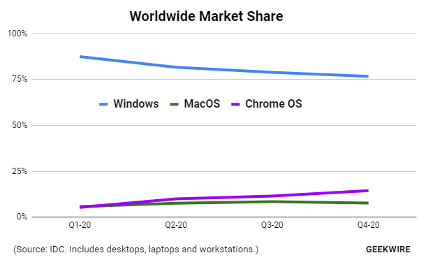

# Projet Fil Rouge

### Contexte
L'année 2020 a été marquée par une hausse des ventes de PC en raison notamment du télétravail, une pratique qui a explosé grâce ou à cause de la pandémie.
En termes de plateformes, macOS a fini l'année avec 7.5% du marché mondial, d'apres [les chiffres d'IDC partagés par Geekwire](https://www.geekwire.com/2021/chromebooks-outsold-macs-worldwide-2020-cutting-windows-market-share/). Pas mal, mais le vrai changement dans ce tableau, c'est que Chrome OS est désormais le deuxième système d'exploitation le plus populaire avec 10,8% du marché. À la fin de l'année 2019, Chrome OS et macOS jouaient encore des coudes du bénéfice d'Apple (6.4% contre 6.7%), mais douze mois plus tard la plateforme de Google avait gagné 4.4 points.

### Problèmatique
Alors que les logiciels propriétairres de Google sont de premier ordre quand ça concerne la qualité, chromeOS manque quand même des logiciels pratiques de productivité.
Ce problème ne concerne pas seulement chromeOS, mais aussi la plupart des navigateurs web modernes. Même s'il ya beaucoup et divers outils de productivité disponibles (e.g. MS OneNote, Tasks, Google Keep, Dashlane), ils necessitent que l'utilisateur gère plusieurs comptes qu'il passe de fenêtre a fenêtre dans son système d'exploitation, ce qui diminue la productivité.

### Solution Proposée
Ce projet fil rouge vise a unifier tout outil de productivité (quick links, to-do, e-mail integration, notes, eBook library, music library, password manager, etc..) dans la fenêtre *New Tab* du navigateur choisi. Il permettera l'utilisateur de gèrer tous ses informations et documents à partir d'un seul compte, ce qui facilitera le passage d'un appareil à un autre sans problèmes.
Et sachant que ce project s'exécutera dans le navigateur, il sera compatible avec n'importe quel appareil, tant que c'est un navigateur web moderne.

L'objectif final de ce projet est de maximiser la productivité de l'utilisateur dans le navigateur, tout en lui permettant de le personnaliser à son goût.

### Choix de technologies
##### Front-End
> **HTML5 - CSS3 - TailWind CSS - JavaScript**

En utilisant une framework CSS simple et JS native, je vise développer un UI/UX unique et pérsonalisable.

##### Back-End
> **NodeJS (KoaJS) - MongoDB**

J'ai choisi NodeJS et MongoDB au lieu de php et mySQL principalement parce que je suis plus à l'aise en les utilisant.