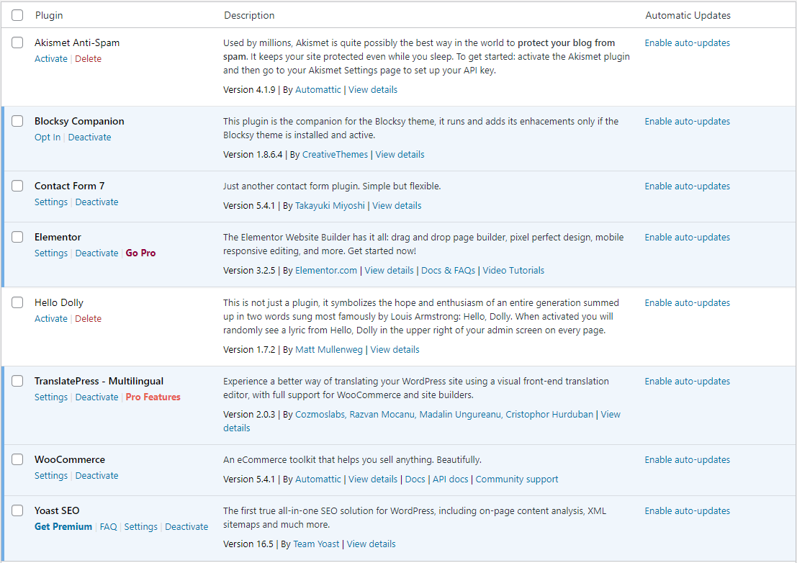
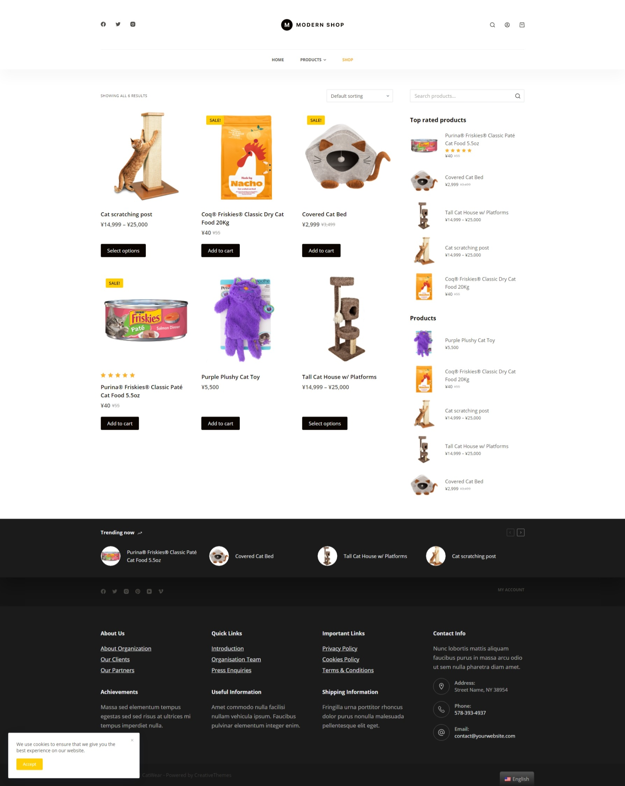
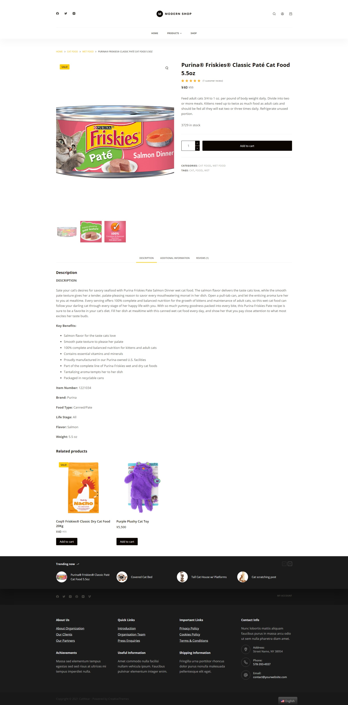

# BRIEF 08 - WooCommerce

## Installation
- Telecharger le ZIP et l'extraire
- Créer la base de données `wc_b8` sur MySQL
- Utiliser un webserver (eg: Apache, Xampp..) pour héberger l'application, ou un serveur php local en utilisant la commande ``` @ php -S localhost:3000 -t .``` dans le dossier.
## Authentification
```
username: dara
password: I$3)jmEKeBN@0lU1bS
```
## Plugins

- **Blocksy Companion**: Un plugin pour accompagner le theme *Blocksy* et apporter des améliorations.
- **Elementor**: Un éditeur drag & drop
- **TranslatePress**: Sert à traduire le site web selon la localization de l'utilisateur grace aux APIs *Google Translate* ou *Deepl*
- **WooCommerce**: Un tool-kit qui facilite la gestion d'un site eCommerce.
- **Yoast SEO**: Un plugin qui aide à optimizer le SEO du site web, et s'intègre avec WooCommerce pour atteindre plus d'utilisateurs.
## Screenshots
***
### **Home**

***
### **Shop**

***
### **Product Listing**

***
### **Cart**

